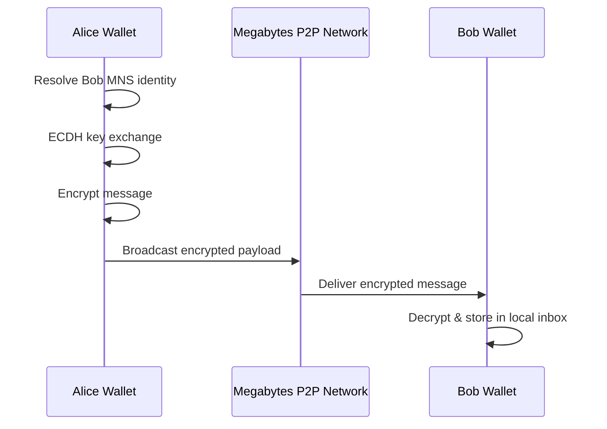

# Megabytes Secure Messaging (MMSG)

A peer-to-peer encrypted messaging layer for the Megabytes blockchain.

Megabytes Secure Messaging (MMSG) enables **fully private, wallet-to-wallet communication** using on-chain identities, strong cryptography, and a serverless peer-to-peer network.

Messages are **never stored on-chain**, **never routed through centralized servers**, and can only be decrypted by the intended recipient’s wallet.

In simple terms:  
**a secure, encrypted chat system built directly into the Megabytes blockchain ecosystem.**

---

## Overview

Most modern messaging systems rely on centralized servers, user accounts, and metadata-heavy infrastructures.

Megabytes Secure Messaging takes a radically different approach:

- No accounts
- No phone numbers
- No email addresses
- No central servers
- No plaintext metadata
- No cloud message storage

Instead, messaging is built on top of **MNS (Megabytes Name System)** identities and executed entirely at the wallet level.

Each message is encrypted end-to-end, propagated peer-to-peer, and stored only in the recipient’s local wallet inbox.

---

## Why Megabytes Secure Messaging

Megabytes Secure Messaging is designed around three core principles:

1. **Identity-first**
2. **Privacy by design**
3. **Decentralization by default**

Unlike traditional chat systems, MMSG does not require trusting infrastructure operators, service providers, or third-party servers.

Your identity is your key.  
Your wallet is your inbox.  
Your messages are yours alone.

---

## Key Features

- 🔐 End-to-end encryption using strong cryptography
- 🧬 On-chain identity resolution via MNS
- 🔑 ECDH key exchange with ephemeral keys
- 📦 Off-chain message storage (local wallet inbox)
- 🌐 Peer-to-peer message propagation
- 🚫 No central servers
- 🚫 No accounts or registrations
- 🛡️ Minimal metadata exposure
- ⚙️ Fully integrated into the Megabytes wallet

---

## Comparison With Other Messaging Systems

| Feature                         | Megabytes MMSG | Signal | Telegram | Matrix | Email |
|--------------------------------|---------------|--------|----------|--------|-------|
| Central server                 | ❌ No          | ✅ Yes | ✅ Yes   | ⚠️ Mixed | ✅ Yes |
| On-chain identity              | ✅ Yes (MNS)   | ❌ No  | ❌ No    | ❌ No  | ❌ No |
| End-to-end encryption          | ✅ Yes         | ✅ Yes | ⚠️ Optional | ⚠️ Optional | ❌ No |
| Phone / Email required         | ❌ No          | ✅ Yes | ✅ Yes   | ❌ No  | ✅ Yes |
| Message storage                | Local wallet  | Server | Server   | Server | Server |
| Metadata resistance            | ✅ High        | ⚠️ Medium | ❌ Low | ⚠️ Medium | ❌ Low |
| Wallet-native integration      | ✅ Yes         | ❌ No  | ❌ No    | ❌ No  | ❌ No |
| Censorship resistance          | ✅ High        | ⚠️ Medium | ❌ Low | ⚠️ Medium | ❌ Low |
| Offline delivery               | ✅ Yes         | ✅ Yes | ✅ Yes   | ✅ Yes | ✅ Yes |

This comparison highlights **design differences**, not superiority claims.  
Megabytes MMSG is optimized for **sovereign identity and decentralized communication**, not mass consumer chat platforms.

---

## How It Works (High Level)

1. A user registers an identity using the Megabytes Name System (MNS)
2. The wallet derives and manages cryptographic identity keys
3. The sender resolves the recipient’s public identity key
4. An encrypted message is created using ECDH key exchange
5. The encrypted payload is propagated peer-to-peer
6. The recipient’s wallet decrypts and stores the message locally

**Message contents are never written to the blockchain.**

---

## Architecture Diagram

---

## Security Model

Megabytes Secure Messaging is built around the following security guarantees:

- Identity binding through MNS
- Wallet-level key management
- End-to-end encrypted payloads
- Ephemeral keys for forward secrecy
- No centralized infrastructure to compromise
- No plaintext message storage outside the wallet

The primary attack surface is limited to the user’s wallet environment.

---

## Threat Model

### Out of Scope
- Compromised wallet or device
- Malware on the user’s system
- Physical access to unlocked wallets

### Mitigated
- Server compromise (no servers)
- Account takeover (no accounts)
- Metadata harvesting
- Mass surveillance via centralized infrastructure

### Possible
- Network-level denial of service
- Peer connectivity attacks (mitigated via P2P design)

---

## What This Is / What This Is Not

### This is:
- A secure messaging layer
- Wallet-to-wallet communication
- Identity-bound encrypted chat
- A building block for decentralized applications

### This is not:
- A social network
- A cloud-based chat service
- A replacement for consumer messengers (UX-wise)
- A platform that stores or monetizes user data

---

## Status & Roadmap

Current status: **Active development**

Planned features:
- [x] Encrypted wallet-to-wallet messaging
- [x] MNS identity resolution
- [x] Off-chain inbox storage
- [ ] Group messaging
- [ ] Attachments
- [ ] Message receipts
- [ ] Mobile wallet integration
- [ ] Extended service discovery via MNS

---

## Philosophy

Megabytes Secure Messaging is designed with a simple idea:

**Private communication should not require trust.**

By combining decentralized identity, strong cryptography, and peer-to-peer networking, Megabytes MMSG provides a messaging system where users retain full control over their communications.

---

## License

This project follows the licensing terms of the Megabytes blockchain project.

---

## Disclaimer

This software is provided as-is, without warranty of any kind.  
Users are responsible for securing their wallets and private keys.
